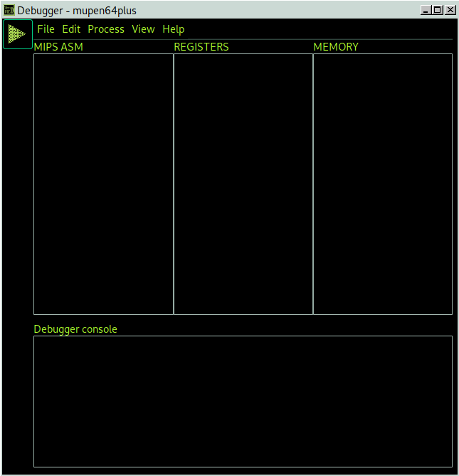

## Multi purpose debugger

MPD is a simple Gtk3-based front-end aiming to provide a graphical interface for common debugging command-line interfaces.

Please see the [CHANGELOG](Changelog.md) for a detailed
list of changes and features.

# Screenshot

